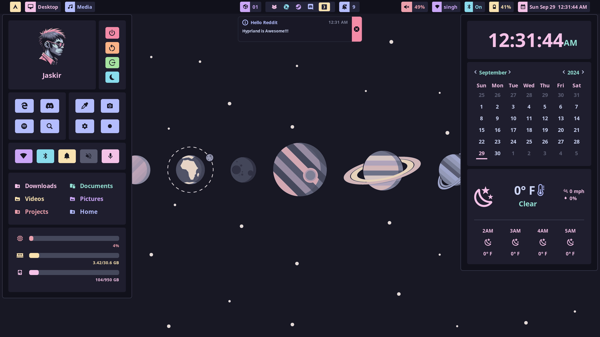
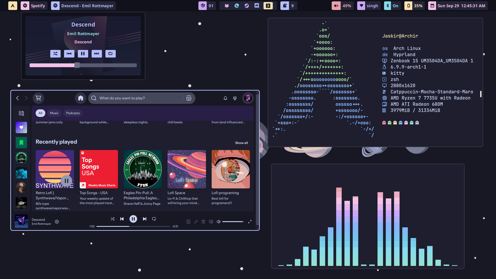

<p align="center">
  <a href="https://hyprpanel.com" target="_blank" rel="noopener noreferrer">
    
  </a>
</p>
<br/>
<p align="center">
  <a href="https://hyprpanel.com/getting_started/installation.html"></a>
  <a href="https://discord.gg/MNpg7Z2b3a"></a>
</p>
<br/>

# HyprPanel 🚀

A panel built for Hyprland with [AGS](https://github.com/Aylur/ags)




## Installation

The [HyprPanel Wiki](https://hyprpanel.com/getting_started/installation.html) contains in depth instructions for installing the panel and all of its dependencies. The instructions below are general instructions for installing the panel.

## Requirements

Bun

```sh
curl -fsSL https://bun.sh/install | bash && \
  sudo ln -s $HOME/.bun/bin/bun /usr/local/bin/bun
```

Additional dependencies:

```sh
pipewire
libgtop
bluez
bluez-utils
grimblast
gpu-screen-recorder
hyprpicker
btop
networkmanager
matugen
wl-clipboard
swww
dart-sass
brightnessctl
gnome-bluetooth-3.0
```

Optional Dependencies:

```sh
## Used for Tracking GPU Usage in your Dashboard (NVidia only)
python
python-gpustat

## Only if a pywal hook from wallpaper changes applied through settings is desired
pywal

## To check for pacman updates in the default script used in the updates module
pacman-contrib

## To switch between power profiles in battery module
power-profiles-daemon
```

### Arch

pacman:

```bash
sudo pacman -S pipewire libgtop bluez bluez-utils btop networkmanager dart-sass wl-clipboard brightnessctl swww python gnome-bluetooth-3.0 pacman-contrib power-profiles-daemon
```

AUR:

```bash
yay -S grimblast-git gpu-screen-recorder hyprpicker matugen-bin python-gpustat aylurs-gtk-shell-git
```

### Fedora

COPR - Add [solopasha/hyprland](https://copr.fedorainfracloud.org/coprs/solopasha/hyprland/) for most hyprland-related dependencies, and [hues-sueh/packages](https://copr.fedorainfracloud.org/coprs/heus-sueh/packages/) for matugen. Both provide the `swww` package, so prioritise the former repo:

```bash
sudo dnf copr enable solopasha/hyprland
sudo dnf copr enable heus-sueh/packages
sudo dnf config-manager --save --setopt=copr:copr.fedorainfracloud.org:heus-sueh:packages.priority=200
```

DNF:

```bash
sudo dnf install pipewire libgtop2 bluez bluez-tools grimblast hyprpicker btop NetworkManager  wl-clipboard swww brightnessctl gnome-bluetooth aylurs-gtk-shell power-profiles-daemon gvfs
```

bun:

```bash
bun install -g sass
```

flatpak:

```bash
flatpak install flathub --system com.dec05eba.gpu_screen_recorder
```

#### Optional Dependencies

pip:

```bash
sudo dnf install python python3-pip; pip install gpustat pywal
```

### NixOS

For NixOS/Home-Manager, see [NixOS & Home-Manager instructions](#nixos--home-manager).

## Instructions

### AGS

Once everything is installed you need to put the contents of this repo in `~/.config/ags`.
If you already have something in `~/.config/ags`, it's recommended that you back it up with:

```bash
mv $HOME/.config/ags $HOME/.config/ags.bkup
```

Otherwise you can use this command to install the panel:

```bash
git clone https://github.com/Jas-SinghFSU/HyprPanel.git && \
  ln -s $(pwd)/HyprPanel $HOME/.config/ags
```

### Nerd Fonts

Additionally, you need to ensure that you have a [Nerd Font](https://www.nerdfonts.com/font-downloads) installed for your icons to render properly.

### Launch the panel

Afterwards you can run the panel with the following command in your terminal:

```bash
ags
```

Or you can add it to your Hyprland config (hyprland.conf) to auto-start with:

```bash
exec-once = ags
```

### NixOS & Home-Manager

Alternatively, if you're using NixOS and/or Home-Manager, you can setup AGS using the provided Nix Flake. First, add the repository to your Flake's inputs, and enable the overlay.

```nix
# flake.nix

{
  inputs.hyprpanel.url = "github:Jas-SinghFSU/HyprPanel";
  # ...

  outputs = { self, nixpkgs, ... }@inputs:
  let
    # ...
	system = "x86_64-linux"; # change to whatever your system should be.
    pkgs = import nixpkgs {
	  inherit system;
	  # ...
	  overlays = [
        inputs.hyprpanel.overlay
	  ];
	};
  in {
    # ...
  }
}
```

Once you've set up the overlay, you can reference HyprPanel with `pkgs.hyprpanel` as if it were any other Nix package. This means you can reference it as a NixOS system/user package, a Home-Manager user package, or as a direct reference in your Hyprland configuration (if your configuration is managed by Home-Manager). The first three methods will add it to your `$PATH` (first globally, second two user-only), however the final will not.

```nix
# configuration.nix

# install it as a system package
environment.systemPackages = with pkgs; [
  # ...
  hyprpanel
  # ...
];

# or install it as a user package
users.users.<username>.packages = with pkgs; [
  # ...
  hyprpanel
  # ...
];


# home.nix

# install it as a user package with home-manager
home.packages = with pkgs; [
  # ...
  hyprpanel
  # ...
];

# or reference it directly in your Hyprland configuration
wayland.windowManager.hyprland.settings.exec-once = [
  "${pkgs.hyprpanel}/bin/hyprpanel"
];

```

### Notifications

HyprPanel handles notifications through the AGS built-in notification service. If you're already using a notification daemon such as Dunst or Mako, you may have to stop them to prevent conflicts with HyprPanel.

> NOTE: If your system is in a language other than English, the resource monitor in the dashboard may not work properly.

## Configuration

The HyprPanel comes with a configuration menu which is available by opening the Dashboard menu (click the button in the bar with the default - Arch - icon) and then clicking the Gear icon.

### Size

The panel is automatically scaled based on your font size in `Configuration > General`.

### Specifying bar layouts per monitor

To specify layouts for each monitor you can create a JSON object such as:

```JSON
{
    "0": {
        "left": [
            "dashboard",
            "workspaces",
            "windowtitle"
        ],
        "middle": [
            "media"
        ],
        "right": [
            "volume",
            "clock",
            "notifications"
        ]
    },
    "1": {
        "left": [
            "dashboard",
            "workspaces",
            "windowtitle"
        ],
        "middle": [
            "media"
        ],
        "right": [
            "volume",
            "clock",
            "notifications"
        ]
    },
    "2": {
        "left": [
            "dashboard",
            "workspaces",
            "windowtitle"
        ],
        "middle": [
            "media"
        ],
        "right": [
            "volume",
            "network",
            "bluetooth",
            "systray",
            "clock",
            "notifications"
        ]
    }
}
```

Where each monitor is defined by its index (0, 1, 2 in this case) and each section (left, middle, right) contains one or more of the following modules:

```js
'battery';
'dashboard';
'workspaces';
'windowtitle';
'media';
'notifications';
'volume';
'network';
'bluetooth';
'clock';
'systray';
```

Since the text-box in the options dialog isn't sufficient, it is recommended that you create this JSON configuration in a text editor elsewhere and paste it into the layout text-box under Configuration > Bar > "Bar Layouts for Monitors".

### Additional Configuration

#### GPU Tracking

If you have an NVidia GPU, you can track your GPU usage in your Dashboard by going to your `Settings > Configuration > Dashboard Menu > Track GPU` and turning it on.
