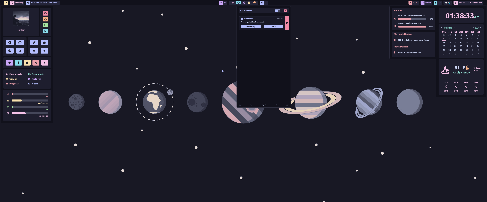

# HyprPanel
A panel built for Hyprland with [Aylur's Gtk Shell](https://github.com/Aylur/ags)

> NOTE: This project is in the process of being migrated fully to TypeScript



## Requirements
Bun

```sh
curl -fsSL https://bun.sh/install | bash && \
  sudo ln -s $HOME/.bun/bin/bun /usr/local/bin/bun
```
Additional dependencies:
```
pipewire
bluez
bluez-utils
grimblast
gpu-screen-recorder
hyprpicker
btop
networkmanager
dart-sass
brightnessctl
python
python-gpustat
gnome-bluetooth-3.0
```

Arch (pacman):
```bash
sudo pacman -S pipewire bluez bluez-utils btop networkmanager dart-sass brightnessctl python gnome-bluetooth-3.0
```

Arch (AUR):
```bash
yay -S grimblast gpu-screen-recorder hyprpicker python-gpustat aylurs-gtk-shell-git
```

## Instructions

### AGS
Once everything is installed you need to put the contents of this repo in `~/.config/ags`.
If you already have something in `~/.config/ags`, it's recommended that you back it up with:
```bash
mv $HOME/.config/ags $HOME/.config/ags.bkup
```
Otherwise you can use this command to install the panel:
```bash
git clone https://github.com/Jas-SinghFSU/HyprPanel.git && \
  ln -s $(pwd)/HyprPanel $HOME/.config/ags
```
### Nerd Fonts
Additionally, you need to ensure that you have a [Nerd Font](https://www.nerdfonts.com/font-downloads) installed for your icons to render properly.

### Launch the panel
Afterwards you can run the panel with the following command in your terminal:
```bash
ags
```

Or you can add it to your Hyprland config (hyprland.conf) to auto-start with:
```bash
exec-once = ags
```

> NOTE: If your system is in a language other than English, the resource monitor in the dashboard may not work properly.

## Configuration

The HyprPanel comes with a configuration menu which is available by opening the Dashboard menu (click the button in the bar with the default - Arch - icon) and then clicking the Gear icon.

### Size

The panel is automatically scaled based on your font size in `Configuration > General`.

### Specifying bar layouts per monitor

To specify layouts for each monitor you can create a JSON object such as:
```JSON
{
    "0": {
        "left": [
            "dashboard",
            "workspaces",
            "windowtitle"
        ],
        "middle": [
            "media"
        ],
        "right": [
            "volume",
            "clock",
            "notifications"
        ]
    },
    "1": {
        "left": [
            "dashboard",
            "workspaces",
            "windowtitle"
        ],
        "middle": [
            "media"
        ],
        "right": [
            "volume",
            "clock",
            "notifications"
        ]
    },
    "2": {
        "left": [
            "dashboard",
            "workspaces",
            "windowtitle"
        ],
        "middle": [
            "media"
        ],
        "right": [
            "volume",
            "network",
            "bluetooth",
            "systray",
            "clock",
            "notifications"
        ]
    }
}
```

Where each monitor is defined by its index (0, 1, 2 in this case) and each section (left, middle, right) contains one or more of the following modules:
```js
"battery"
"dashboard"
"workspaces"
"windowtitle"
"media"
"notifications"
"volume"
"network"
"bluetooth"
"clock"
"systray"
```
Since the text-box in the options dialog isn't sufficient, it is recommended that you create this JSON configuration in a text editor elsewhere and paste it into the layout text-box under Configuration > Bar > "Bar Layouts for Monitors".
